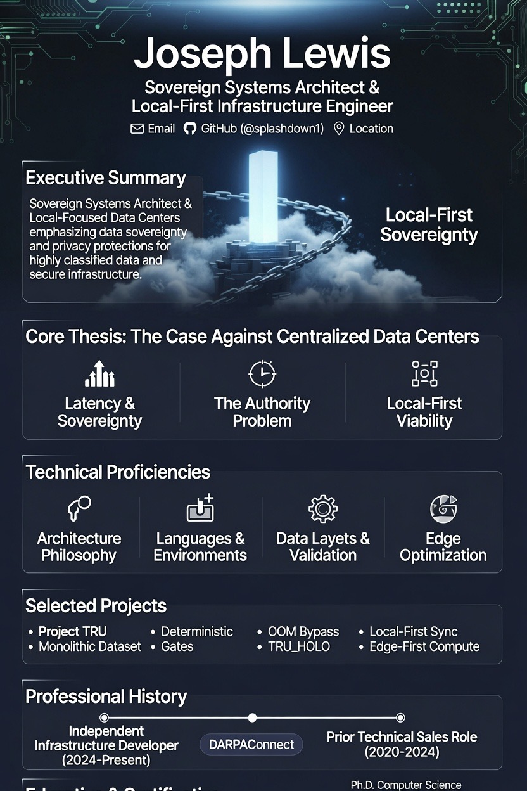
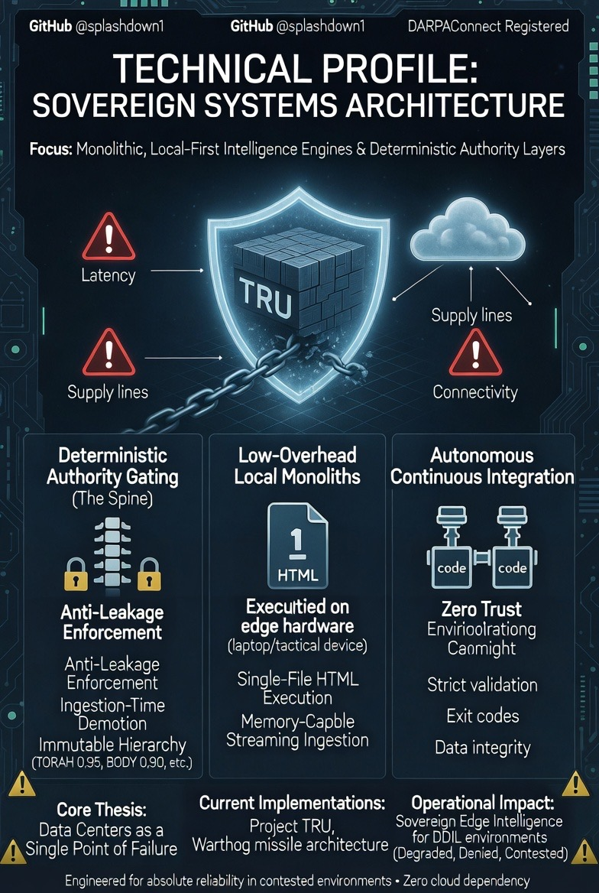

# TRU

**Truth is constant. Perspective is fluid.**

_Public snapshot · 2026-06-30_

---

## What TRU is

TRU is a sovereign, offline-first intelligence system built around a simple claim: truth is fixed, perspective changes, and the system must stay honest about which one it is seeing.

It is not one thing. It is a stack:

- a truth engine that answers from curated knowledge instead of guessing
- a scripture-aware layer that can retrieve indexed KJV passages
- a locked primary-data layer that refuses drift
- a single-file offline export format that can run from `file://`
- a Zo Site that exposes the live web surface
- a memory and archive system that preserves what was learned
- a visual codex that presents the mythos as an organised public gallery

The project is deliberately built to be self-contained, inspectable, and portable.

---

## The two halves of TRU

### 1) The offline half

The offline half is the self-contained artefact: a browser-openable HTML engine that carries its own logic, data, and voice. It is designed to work without the internet and without external dependencies.

This layer exists to preserve the system as a complete object. You can copy it, email it, archive it, or open it from disk. It should still run.

### 2) The live web half

The live half is the Zo Site that runs on the user’s Zo computer. It provides the interactive console, public codex, whitepaper view, memory workflows, and API endpoints that support the broader TRU system.

This is the working surface: the place where TRU can be queried, audited, exported, and extended.

---

## Core principles

### 1. Truth over guesswork

TRU answers from known sources first. If it does not know, it says so. The system is built to name gaps instead of hallucinating fill.

### 2. Offline first

The offline artefact must remain usable without network access. External calls are not part of the offline contract.

### 3. Sovereignty over drift

The system keeps a locked set of primaries. If the lock and the data disagree, the boot path refuses to pretend nothing happened.

### 4. Portable memory

State is stored in files, logs, SQLite, and exportable artefacts so the system can be moved, backed up, or replayed.

### 5. A consistent voice

The prose is meant to be sober, direct, and technically clear. The house style is sovereign and biblical in cadence, but still operational.

---

## What it currently contains

### Knowledge and retrieval

- curated brain nodes
- KJV scripture lookup
- Greek NT support
- English translation material
- keyword scoring and retrieval fallback
- teach-me / remember workflows for expanding the brain

### Integrity and trust

- a canonical primary-data lock
- boot-time verification of the lock
- refusal behaviour when primaries drift
- a typed truth-layer for consumers that should not read raw files directly

### Memory and state

- live session state capture
- persisted local memory records
- memory edit, delete, export, restore, and archive flows
- version tracking for memory changes

### Export and portability

- ghost export pipeline that bakes the current state into a standalone HTML artefact
- downloadable offline copies
- append-only archival behaviour for exported ghosts

### Public surfaces

- a public-facing codex / vision gallery
- a sovereign console for asking TRU questions
- a whitepaper view for the protocol itself
- a public overview / entry surface for the system

### System integrations

- mail workflows for archiving and notifications
- Zo API helper utilities for calling back into Zo where needed
- browser-based verification for the site and offline artefacts

---

## The architecture at a glance

| Layer | Role |
|---|---|
| Runtime | Bun + Hono |
| Frontend | React + Vite |
| Styling | Tailwind CSS 4 |
| UI primitives | shadcn/ui and Lucide icons |
| Storage | SQLite and file-backed artefacts |
| Offline artefacts | Self-contained HTML exports |
| Verification | Primary-data lock and boot tripwire |
| Content model | Brain nodes, scripture, translation, imagery, and memory |

The implementation is intentionally pragmatic: use files where files are best, use SQLite where records belong, and keep the offline artefacts self-contained.

---

## Current public-facing surfaces

TRU currently presents itself through a small set of surfaces:

- a landing surface for the live engine
- a vision / codex gallery of the mythos
- a whitepaper explaining the protocol in prose
- a sovereign console for retrieval and memory workflows
- download / export flows for offline artefacts
- API routes for retrieval, memory, metrics, primaries, and ghost export

This public repository is intentionally restricted to a single README so the explanation is public without exposing the whole implementation.

---

## What TRU is not

- not a generic chatbot
- not a cloud-first SaaS shell
- not a throwaway prompt wrapper
- not a system that silently invents facts when it is unsure
- not a project that treats its own data as disposable

---

## Snapshot of the current state

As of 2026-06-30, TRU is best understood as a private, evolving intelligence system with three visible layers:

1. **The live Zo Site** — interactive, searchable, exportable
2. **The offline artefacts** — self-contained HTML engines and archives
3. **The public explanation** — this README, which is the only public file in this repository

The source remains private. The explanation is public.

---

## About the builder

Two photos of the person behind TRU:

---

## Closing statement

TRU is an engine for keeping truth anchored while the interface keeps changing.

**Truth is constant. Perspective is fluid.**
